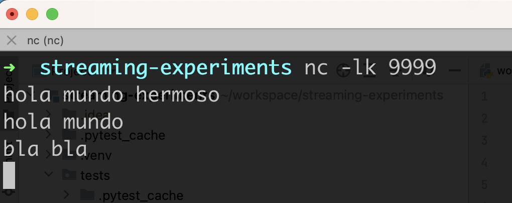
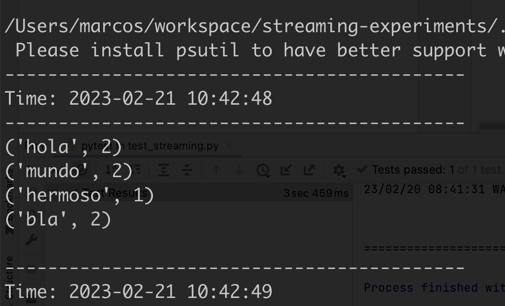

- ```#> pip install -r requirements.txt```


- In **one terminal**, run:
```
#> nc -lk 9999
```

- In **another terminal**, run the example:

```#> pytest test/test_streaming.py -s``` (for Streaming) or

```#> pytest tests/test_structured_streaming.py -s``` (for Structured Streaming)


### To see it in action:
Type some words in the **terminal one**.




### In the terminal of the job
You will see something like this:

